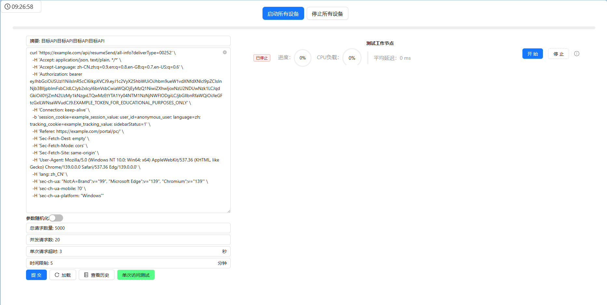
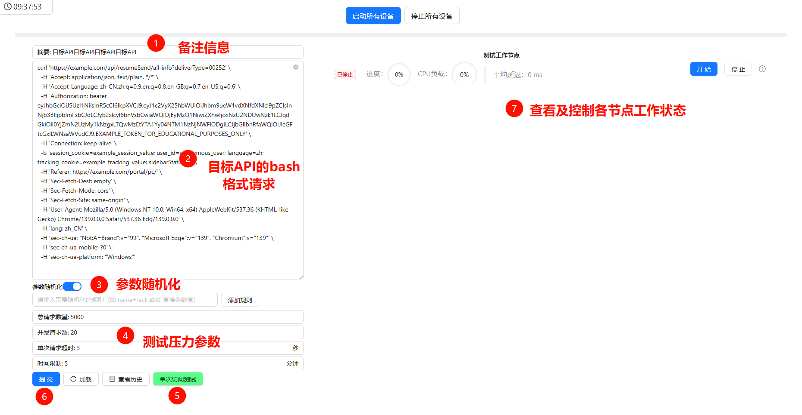
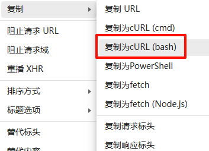

## 项目展示




## 部署步骤

配合**前端项目**启动：[DDos-frontend](https://github.com/George551556/ddos-frontend) 

- 主节点

  1. 创建MySQL数据表

  2. 开放前端`3000`端口

  3. 启动前端项目

     ```bash
     npm run build
     npm install -g serve
     serve -s build
     ```

  4. 启动后端服务

     ```bash
     go run .
     ```

- 从（工作）节点

  1. 首先修改配置文件中地址和端口为主节点服务所在地址端口

  2. 运行命令启动

     ```bash
     go run .
     ```

     


## 使用步骤



1. 备注信息：用于在数据库中标识

2. bash格式请求体：可以从浏览器 控制台- >网络 中复制，直接粘贴在该处，系统可自动解析

   

3. 参数随机化：例如输入请求体中含有的字符串`name=JackSon` 或者 `JackSon`，系统持续自动随机生成同等长度字符串替换原始请求体，并不断向目标主机请求，理想情况下可显著增大目标主机CPU占用

4. 测试压力参数：依实际需要设置

5. 单次访问测试：发送单个请求测试API可用性

6. 提交：开始按设置的参数进行任务

7. 节点列表：所有已连接工作节点会显示在此处，CPU负载为该节点自身的CPU占用率，平均延迟为节点访问目标API的平均延迟，鼠标移动到最右侧 处可查看关于该节点更多信息
